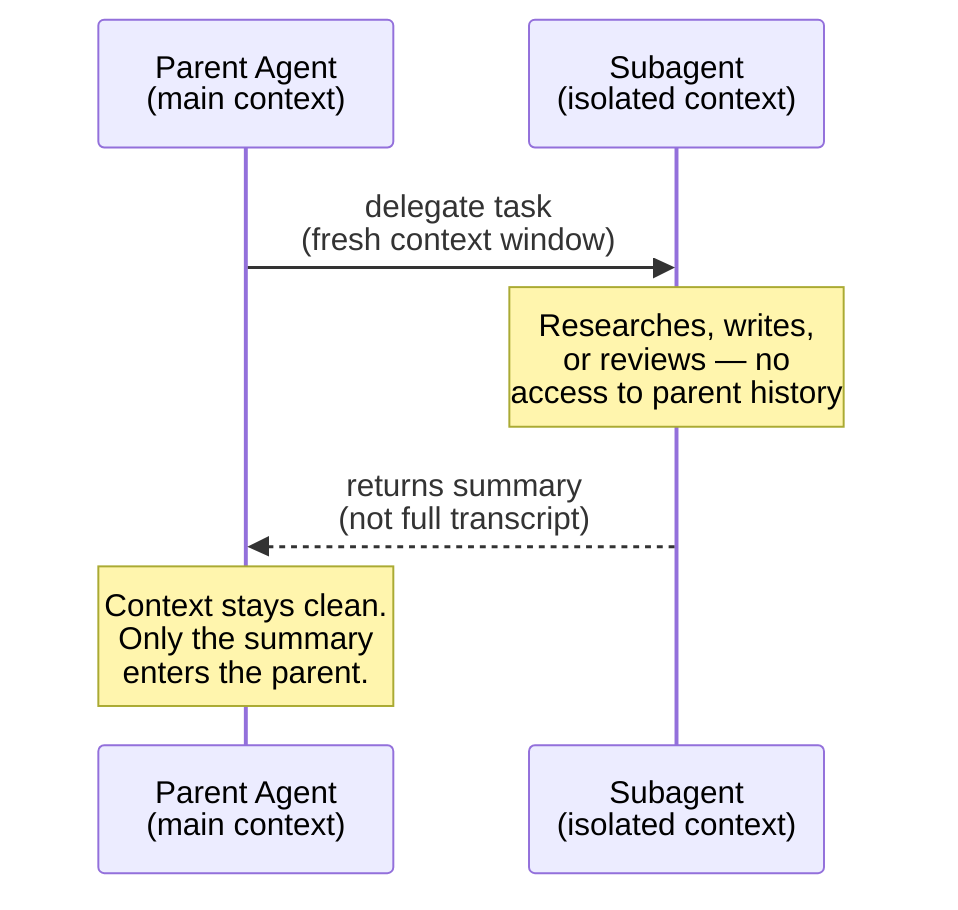
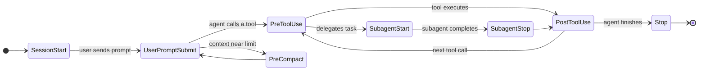
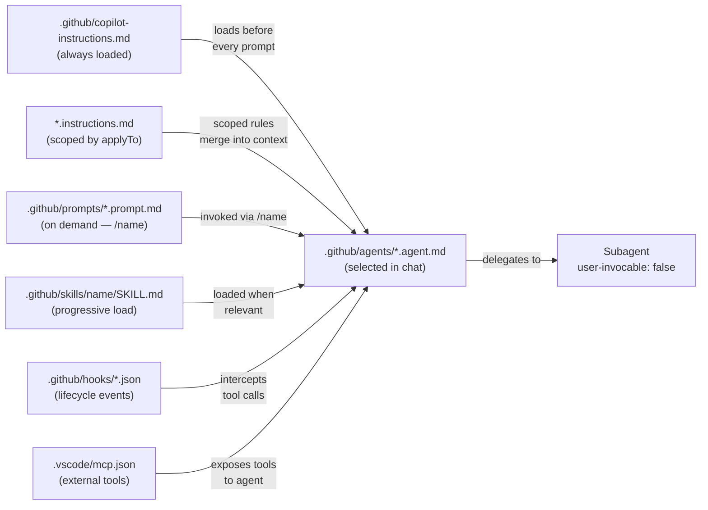
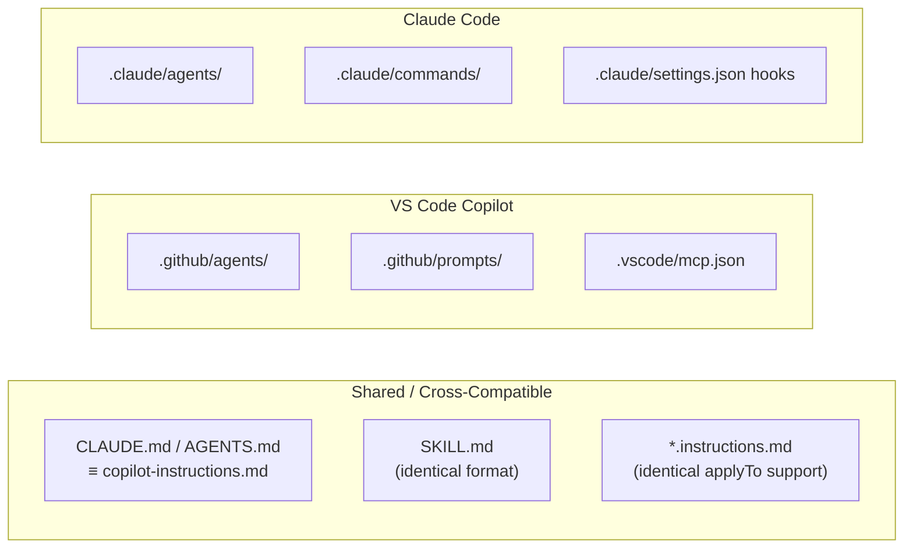

# Concepts

Every file type on this page is an abstraction layer in a **reliability stack**. The stack defines where each asset lives in the agent's context and how much it costs to load — not all context is equal, and not all assets load on every request.

## The 5-Layer Reliability Stack

<pre class="ascii-diagram">
┌─────────────────────────────────────────────────────────────┐
│  LAYER 5 — EVALUATOR / VERIFICATION                         │
│  verify-app subagent, tests, hooks, PostToolUse             │
├─────────────────────────────────────────────────────────────┤
│  LAYER 4 — SUBAGENTS / AGENT TEAMS                          │
│  Isolated workers for context-safe parallel execution       │
├─────────────────────────────────────────────────────────────┤
│  LAYER 3 — SKILLS / SLASH COMMANDS                          │
│  Repeatable workflows, domain knowledge, inner-loop tasks   │
├─────────────────────────────────────────────────────────────┤
│  LAYER 2 — PLANNING (Plan Mode / Plan Agent)                │
│  Spec → PRD → Architecture → Task List before any code      │
├─────────────────────────────────────────────────────────────┤
│  LAYER 1 — MEMORY / CONTEXT                                 │
│  copilot-instructions.md / CLAUDE.md — always-on context   │
└─────────────────────────────────────────────────────────────┘
</pre>

Each section below maps to a layer. The order here — from Memory up to Evaluator — is the order you build in. Set Layer 1 before you write a single prompt.

---

## Custom Instructions

**Layer:** Memory (Layer 1)  
**Lives at:** `.github/copilot-instructions.md` (repo-wide) or `*.instructions.md` files (scoped)  
**What it is:** Always-on context loaded before every request in the workspace.  
**When to use it:** Project coding standards, toolchain rules, naming conventions, anti-patterns — anything the agent must always remember.

The hierarchy: `.github/copilot-instructions.md` applies to every request. An `*.instructions.md` file in a subfolder can scope rules to specific file patterns via the `applyTo` frontmatter. Both are cross-compatible — VS Code Copilot, Claude Code, Cursor, and Gemini CLI all discover these files.

The **70% rule** (Boris Cherny): instructions compliance is approximately 70%. For non-negotiable rules — never commit to main, never write to prod — move them to Hooks instead. Instructions are for conventions; hooks are for enforcement.

Keep instructions under 50–100 lines. Long instructions are ignored instructions. Ask "would removing this cause the agent to make a mistake?" If not, cut it.

```markdown
---
applyTo: "**/*.ts,**/*.tsx"
---
- Use strict TypeScript — no `any`
- Prefer `type` over `interface` for object shapes
- Use Zod for all runtime validation
- Never use `console.log` — use `logger.debug()`
- Imports: external packages first, then internal, alphabetical within each group
```

**Official docs:** [Custom instructions in VS Code](https://code.visualstudio.com/docs/copilot/customization/custom-instructions)  
**Reference:** [§1.1 Memory Layer — CLAUDE.md](/workshop/reference/#section-1-1)

---

## Prompt Files

**Layer:** Skills (Layer 3)  
**Lives at:** `.github/prompts/*.prompt.md`  
**What it is:** Named, reusable prompts invoked via `/prompt-name` in chat.  
**When to use it:** Repeatable workflows you'd otherwise retype — "generate unit tests", "prepare PR description", "audit this for security issues".

Unlike instructions (always-on), prompt files are on-demand. They also accept frontmatter that locks in the model, available tools, and mode for that specific workflow. A prompt file is the first rung of the reusability ladder: it costs nothing to write and immediately makes any repeatable workflow reproducible.

The `/create-prompt` command in VS Code chat auto-generates a prompt file from your description.

```markdown
---
name: write-tests
description: Generate comprehensive unit tests for a function or module
tools: ['codebase']
---
Read the project's test conventions from any .instructions.md files.

Analyze the function signature and behavior. Generate tests covering:
- Happy path with representative inputs
- Edge cases (empty, null, boundary values)
- Error conditions and exception handling

Use the project's test framework and naming conventions throughout.
```

**Official docs:** [Prompt files in VS Code](https://code.visualstudio.com/docs/copilot/customization/prompt-files)  
**Reference:** [§1.3 Skills Layer — Slash Commands](/workshop/reference/#section-1-3)

---

## Slash Commands

**Layer:** Skills (Layer 3)  
**Lives at:** Derived automatically from `.prompt.md` filenames — no separate file  
**What it is:** `/prompt-name` invocations that run a saved prompt file by name.  
**When to use it:** Inner-loop tasks you trigger multiple times per day.

There are no separate "slash command files" in VS Code Copilot — every `.prompt.md` in `.github/prompts/` becomes a `/command` automatically. Type `/` in chat to see available ones alongside the built-in commands (`/fix`, `/explain`, `/tests`).

Boris Cherny's core commands that earn their place:
- `/commit-push-pr` — commit with a message derived from the diff, push, open PR
- `/fix-issue` — takes an issue number, implements end-to-end
- `/code-review` — structured checklist against project standards
- `/simplify` — post-implementation cleanup pass
- `/deploy` — pre-flight checks and deploy steps

The rule: build a slash command only for tasks you run three or more times per week. Anything less frequent is just a saved prompt in your notes — don't create the asset.

**Reference:** [§1.3 Skills Layer — Slash Commands](/workshop/reference/#section-1-3)

---

## Chat Modes

**Layer:** Skills (Layer 3)  
**Lives at:** `.github/chatmodes/*.chatmode.md`  
**What it is:** Named chat configurations that restrict available tools and set a persistent system prompt for a type of work.  
**When to use it:** When you need a "read-only research mode", a "documentation mode", or any context where a restricted toolset is correct for the whole session.

Chat modes differ from custom agents in scope: a mode applies to the entire chat interface for the session, while an agent applies to a specific task. Use modes when you want to constrain your own behavior, not delegate to another persona.

```markdown
---
description: Read-only codebase exploration — no file edits allowed
tools: ['codebase']
---
You are in research mode. Explore and analyze the codebase only.
Do not write, edit, or delete any files under any circumstances.
Produce a structured summary: what exists, how it connects, what's missing.
```

---

## Skills

**Layer:** Skills (Layer 3)  
**Lives at:** `.github/skills/<name>/SKILL.md` plus supporting scripts and templates  
**What it is:** A self-contained capability package that loads progressively — instructions first, then supporting files on demand.  
**When to use it:** Multi-step workflows that need scripts, templates, or external resources — anything too complex for a prompt file alone.

Skills use **three-level progressive loading**: (1) discovery — the `description` field is read cheaply to assess relevance; (2) full instructions — `SKILL.md` loads when the skill is invoked; (3) supporting resources — scripts, templates, data load as needed. The model sees level 1 for all skills on every request; levels 2–3 only when relevant. This keeps context lean.

The SKILL.md format is **cross-compatible**: skills written for VS Code Copilot work identically in Claude Code, Cursor, and Gemini CLI. Use `/create-skill` in VS Code chat to auto-generate from a description.

```markdown
---
name: api-development
description: Implement REST/tRPC API endpoints following team conventions.
  Use when creating new endpoints, handlers, or API routes.
user-invocable: true
argument-hint: "[endpoint name] [HTTP method]"
---

## API Conventions
- All endpoints validate input with Zod schemas
- Structured error responses: { error: string, code: string }
- Every handler needs try/catch with logger.error()
- Rate limiting on all public endpoints

## Steps
1. Create Zod schema in src/schemas/
2. Create handler in src/handlers/
3. Register route in src/router.ts
4. Write unit test in src/handlers/__tests__/
5. Update API docs in docs/api.md
```

**Official docs:** [Agent skills in VS Code](https://code.visualstudio.com/docs/copilot/customization/agent-skills)  
**Reference:** [§1.3 Skills / §2.3 VS Code Skills](/workshop/reference/#section-1-3)

---

## Custom Agents

**Layer:** Subagents (Layer 4)  
**Lives at:** `.github/agents/*.agent.md`  
**What it is:** A named AI persona with a specific toolset, model, and instructions — selectable from the chat mode dropdown.  
**When to use it:** When a task requires a distinct role with restricted tools: "CodeReviewer" with read-only access, "SecurityAuditor" with a specific checklist, "SprintFacilitator" that can never write code.

The `tools` field is not a suggestion — it is hard enforcement. An agent with `tools: ['codebase', 'search']` cannot write files regardless of what it is instructed to do. The `handoffs` field lets one agent hand off to another with a pre-composed prompt, enabling explicit pipelines: Planner → Implementer → Reviewer.

```markdown
---
name: Security Reviewer
description: Reviews code for vulnerabilities before deployment.
  Use when auditing PRs, new API endpoints, or auth flows.
tools: ['codebase', 'search']
model: claude-opus-4-7
handoffs:
  - label: Fix Issues
    agent: agent
    prompt: Fix the security issues identified in the review.
---

You are a senior security engineer. Read code only — never write or edit.
Review for: SQL/XSS/command injection, auth flaws, secrets in code, insecure deps.
Return: PASS / WARN / FAIL with specific file and line references.
```

**Official docs:** [Custom agents in VS Code](https://code.visualstudio.com/docs/copilot/customization/custom-agents)  
**Reference:** [§2.4 Custom Agents](/workshop/reference/#section-2-4)

---

## Subagents

**Layer:** Subagents (Layer 4)  
**Lives at:** Same as custom agents — `.github/agents/*.agent.md` with `user-invocable: false`  
**What it is:** An agent that runs in an isolated context window and returns its summary to the parent.  
**When to use it:** Any task where context isolation matters — codebase research, security review, code critique, verification, parallelizable work.

The critical concept is **context isolation**: the subagent starts fresh with zero memory of the parent's session. This prevents context rot — the gradual degradation in output quality as a single session accumulates noise. The practical rule: "A fresh session starts at ~20k tokens. Quality degrades at 20–40% context fill. Do not let context exceed 60%." Use subagents to do the work that would otherwise fill the parent's context.



<p class="diagram-caption">The subagent starts cold. Only its summary returns to the parent — protecting the parent's context budget.</p>

Core subagents worth building for every project:

| Subagent | Tools | Purpose |
|---|---|---|
| `explore` | Read, search | Codebase research — never use main session for this |
| `code-simplifier` | Read, edit | Post-implementation cleanup pass |
| `verify-app` | Browser, bash | E2E testing, UI verification |
| `security-reviewer` | Read, search | Pre-deploy security audit |
| `test-writer` | Read, edit, bash | Generate + run tests |

```markdown
---
name: security-reviewer
description: Reviews code for security vulnerabilities before deployment.
  Use when reviewing PRs, before shipping endpoints, auditing auth flows.
tools: ['codebase', 'search']
model: claude-opus-4-7
user-invocable: false
---

You are a senior security engineer. Read only — do not edit files.
Review for: SQL/XSS/command injection, auth flaws, secrets in code.
Return: PASS / WARN / FAIL with specific line references and remediation steps.
```

**Official docs:** [Subagents in VS Code](https://code.visualstudio.com/docs/copilot/agents/subagents)  
**Reference:** [§1.4 Subagents Layer](/workshop/reference/#section-1-4)

---

## Hooks

**Layer:** Evaluator (Layer 5)  
**Lives at:** `.github/hooks/*.json` or the `hooks` field in `.agent.md` frontmatter  
**What it is:** Shell commands triggered deterministically at agent lifecycle events.  
**When to use it:** Code formatting, linting, blocking unsafe operations, logging, notifications. Any side effect that must happen 100% of the time.

The enforcement gap: instructions compliance is ~70%. Hooks are 100%. Move non-negotiable rules — "always format after editing", "never push to main", "run tests before commit" — to hooks rather than instructions. The agent cannot bypass a hook.

Eight lifecycle events:



<p class="diagram-caption">8 lifecycle hook points. PreToolUse can block an action before it happens. PostToolUse can repair or validate after.</p>

```json
{
  "hooks": {
    "PostToolUse": [{
      "matcher": "Edit|Write",
      "hooks": [{
        "type": "command",
        "command": "prettier --write \"$CLAUDE_TOOL_INPUT_PATH\" 2>/dev/null || true"
      }]
    }]
  }
}
```

Common hook patterns:
- `PostToolUse` on `Edit|Write` → run formatter (`prettier`, `ruff`, `gofmt`)
- `PreToolUse` on `Bash` matching `git push` → block pushes to main
- `PostToolUse` on `Edit` matching `*.test.*` → run the test suite
- `Stop` → send a desktop notification when the task completes

**Official docs:** [Hooks in VS Code](https://code.visualstudio.com/docs/copilot/customization/hooks)  
**Reference:** [§1.8 Hooks / §2.6 VS Code Hooks](/workshop/reference/#section-1-8)

---

## MCP Servers

**Layer:** Evaluator / cross-cutting  
**Lives at:** `.vscode/mcp.json` (workspace) or user MCP config  
**What it is:** External tool connections — databases, APIs, services — exposed as callable tools in agent mode only.  
**When to use it:** When the agent needs to query real data: a database, GitHub API, Figma designs, Slack threads, or any external system.

The 20k rule: "If you're using more than 20k tokens of MCPs, you're crippling Claude." Every connected MCP server's tool schema consumes context on every request. Load only what the current session actively uses — remove idle connections.

```json
{
  "servers": {
    "postgres": {
      "command": "npx",
      "args": ["-y", "@modelcontextprotocol/server-postgres"],
      "env": {
        "POSTGRES_CONNECTION_STRING": "${env:PG_CONN}"
      }
    },
    "github": {
      "type": "http",
      "url": "https://api.githubcopilot.com/mcp/"
    }
  }
}
```

Essential MCPs by use case:

| MCP | Use case |
|---|---|
| Playwright | Browser E2E testing, UI verification |
| PostgreSQL / SQLite | Direct schema queries, data inspection |
| GitHub | Issues, PRs, CI status without leaving the editor |
| Figma | Read design specs and component properties |
| DuckDB | In-process SQL over CSV/Parquet files |
| Slack | Read bug reports and thread context |

**Official docs:** [MCP servers in VS Code](https://code.visualstudio.com/docs/copilot/customization/mcp-servers)  
**Reference:** [§1.9 MCP Servers](/workshop/reference/#section-1-9)

---

## How It Fits Together

The diagram below shows the runtime relationships between all nine file types.



<p class="diagram-caption">All roads lead to the agent. Instructions load automatically; prompts and skills load on demand; hooks intercept tool calls deterministically; MCP servers extend what the agent can reach.</p>

---

## VS Code ↔ Claude Code Parity

Both tools share a mental model. File locations differ; the concepts are functionally identical.



| Concept | VS Code Copilot | Claude Code | Notes |
|---|---|---|---|
| Always-on instructions | `.github/copilot-instructions.md` | `CLAUDE.md` | Same concept, different filename |
| Scoped instructions | `*.instructions.md` (applyTo) | `*.instructions.md` (applyTo) | Identical format |
| Repeatable prompts | `.github/prompts/*.prompt.md` | `.claude/commands/*.md` | Similar; VS Code has richer frontmatter |
| Skills | `.github/skills/*/SKILL.md` | `.claude/skills/*/SKILL.md` | Identical SKILL.md format |
| Custom agents | `.github/agents/*.agent.md` | `.claude/agents/*.md` | Similar; VS Code adds `handoffs` |
| Subagents | `user-invocable: false` | `Agent()` tool call | Same isolation model |
| Hooks | `.github/hooks/*.json` | `.claude/settings.json` hooks | Same 8 lifecycle events |
| MCP | `.vscode/mcp.json` | `.claude/mcp.json` | Same MCP protocol |

Skills written in SKILL.md format are compatible across VS Code Copilot, Claude Code, Cursor, and Gemini CLI. Build once, use everywhere.

---

## Model Selection

The right model for the right task is not optional at scale — routing incorrectly costs either quality or money.

| Task | Recommended Model | Why |
|---|---|---|
| Planning, architecture | Opus (with thinking) | Deep reasoning, fewer steering corrections |
| Feature implementation | Sonnet | Good balance of speed and quality |
| Code search, file exploration | Haiku | Fast, cheap, read-only tasks |
| Security review | Opus | High-stakes, needs careful reasoning |
| Boilerplate generation | Sonnet | Speed matters more than depth |
| Debugging complex issues | Opus (with thinking) | Root cause analysis needs depth |

<div class="callout callout-tip">
<p>Boris Cherny's rule: "Even though Opus is bigger and slower, since you have to steer it less and it's better at tool use, it is almost always faster than using a smaller model in the end." Route subagents to the right model to control costs: Explore → Haiku, Plan → Sonnet, Security / Architecture → Opus.</p>
</div>
