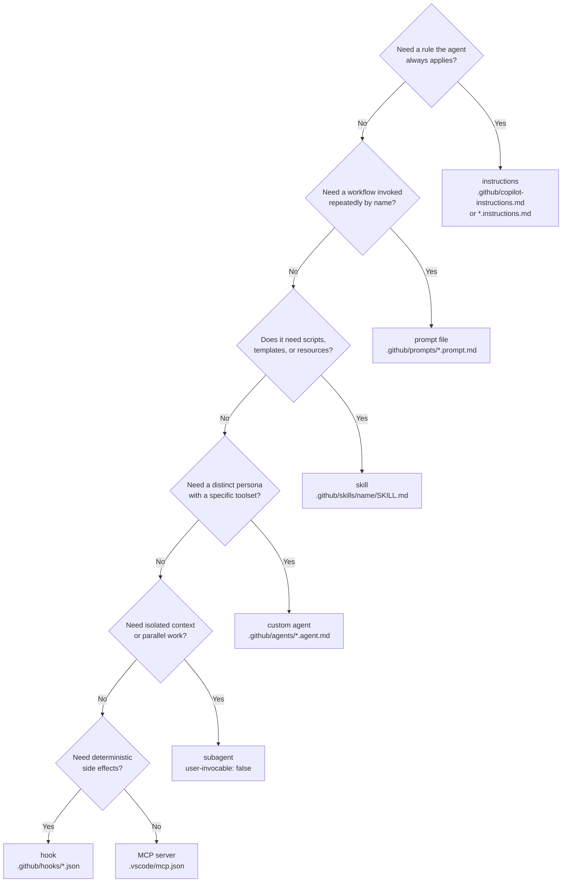
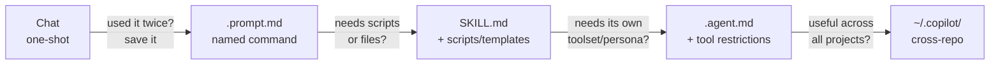

# Connecting the Dots

Knowing what each file type does is necessary but not sufficient. These four frameworks tell you which one to reach for and when — and which ones most teams misuse in their first month.

---

## Which Tool, When

Start with the decision tree. The bullet list below it is the printable version.

Decision tree for VS Code Copilot asset selection. Each branch represents a different loading cost and a different failure mode when misused.

Printable version:

- Need a rule the agent should always remember? → **custom instructions**
- Need a workflow you'll invoke repeatedly by name? → **prompt file**
- Need a multi-step capability with scripts and templates? → **skill**
- Need a separate persona with its own restricted toolset? → **custom agent**
- Need isolated context — research, review, or parallel work? → **subagent**
- Need deterministic side effects (format, lint, notify)? → **hook**
- Need to connect external data or APIs? → **MCP server**

---

## The Reusability Ladder

A one-shot chat prompt is the bottom of the ladder. Every rung makes the work more reusable, cheaper to repeat, and more correct — because the conventions are encoded in the asset, not re-derived from scratch each time.

Climb the ladder when the cost of rewriting exceeds the cost of creating the asset. Most workflows plateau at Skills — agents add overhead only when a distinct persona with tool restrictions is genuinely needed.

When to climb:

- **Chat → Prompt file:** you used the same prompt text twice. Move it to `.prompt.md`. Cost: 5 minutes. Payoff: reproducible forever.
- **Prompt file → Skill:** the workflow now needs external scripts, templates, or reference files. The `SKILL.md` bundles them with the instructions.
- **Skill → Agent:** the workflow needs a specific toolset (e.g., read-only) or a persistent persona that the main agent shouldn't be. The `user-invocable: false` variant becomes a subagent.
- **Agent → User profile:** the agent is useful across all your projects. Move it to `~/.copilot/agents/`. No per-project setup required.

---

## The Project Lifecycle

The same four phases apply regardless of tool. The VS Code and Claude Code columns differ only in command names — the workflow is identical.

<pre class="ascii-diagram">
PLANNING PHASE
━━━━━━━━━━━━━━━━━━━━━━━━━━━━━━━━━━━━━━━━━━━━━━━━━━
Claude Code:  Shift+Tab → Plan Mode → iterate plan → approve
VS Code:      Select Plan agent → describe feature → review plan → handoff
Both:         Store plan as plan.md in project
              Annotate plan with your architectural decisions
              Don't let the agent write code until the plan is approved

DEVELOPMENT PHASE
━━━━━━━━━━━━━━━━━━━━━━━━━━━━━━━━━━━━━━━━━━━━━━━━━━
Claude Code:  Switch to auto-accept → Claude 1-shots from plan
VS Code:      Select local agent → implement from plan
Both:         Keep context under 60% of session window
              Use subagents for research (not main session)
              Skills auto-load for domain-specific tasks

VERIFICATION PHASE
━━━━━━━━━━━━━━━━━━━━━━━━━━━━━━━━━━━━━━━━━━━━━━━━━━
Claude Code:  code-simplifier → verify-app → security-reviewer
VS Code:      Delegate to code-reviewer agent → delegate to tester agent
Both:         Automated tests must pass
              Format enforced via PostToolUse hooks
              Human reviews the diff before merge

SHIP PHASE
━━━━━━━━━━━━━━━━━━━━━━━━━━━━━━━━━━━━━━━━━━━━━━━━━━
Claude Code:  /commit-push-pr
VS Code:      Cloud agent creates PR / local agent creates PR
Both:         Update instructions file with any lessons learned
              Tag PR for async review if needed
</pre>

The Boris Rule: "A good plan is really important. If my goal is to write a Pull Request, I use Plan Mode, go back and forth with Claude until I like the plan. From there I switch to auto-accept and Claude can usually 1-shot it." A well-planned task is a mechanical execution — the agent stops making choices.

---

## What Not To Do

These anti-patterns are reproduced from the [companion reference doc](/workshop/reference/) because they're the ones teams hit in their first month. The fix column is the decision that prevents the failure mode.

| Anti-Pattern | Why It Fails | Fix |
|---|---|---|
| `copilot-instructions.md` > 200 lines | Critical rules get lost in noise | Ruthlessly prune; move workflows to Skills |
| Vibe coding (no plan) | 40 changes you didn't want | Always plan first, especially for multi-file |
| Infinite exploration in main session | Fills context before any code | Scope narrowly, or use a subagent |
| Over-engineering with MCPs | >20k tokens of MCPs = 20k left for work | Install only what you actively use |
| Too many slash commands | Creates anti-pattern; defeats the purpose | Build commands only for true inner-loop repeats |
| Long unbroken sessions | Context rot kills output quality | `/clear` between tasks; fresh session per task |
| No tests or verification | "Plausible-looking" code ships broken | Always provide a verification mechanism |
| No hooks for critical rules | 70% instructions compliance on safety rules | Move non-negotiable rules to hooks |
| Stale instructions file | Agent learns wrong patterns | Update after every mistake; version-control it |
| Using Sonnet when Opus steers less | More corrections = slower overall | Opus is often faster end-to-end |

VS-Code-specific failure modes:

Don't dump everything into <code>copilot-instructions.md</code>. 50–100 lines max. Long instructions become background noise the model learns to ignore. If you're tempted to add more, ask: "Would removing this cause the agent to make a mistake?" If no, cut it.

Don't write skills for one-time tasks. Skills are for repeatable, multi-step workflows. A task you've run once is a prompt file. A task you've run three times that needs supporting templates is a skill. One-time tasks belong in a prompt, not a skill — the overhead isn't justified.

Don't skip the <code>description:</code> field on skills, agents, or subagents. The description is the level-1 discovery mechanism — it's how the model decides whether to load the full asset. A vague description means the model never invokes it, or invokes it for the wrong task.

Don't exceed 20k tokens of active MCP servers. Every connected server's tool schema enters context on every request — before the agent writes a single character of response. Keep only what the current session actively uses. Disconnect idle servers.

