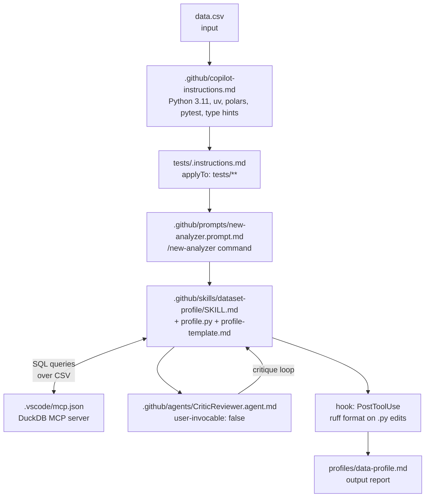

# Project: EDA Analyser (Developer Track)

This project builds a Python EDA (exploratory data analysis) tool *with* the agent, but with structured guardrails so the work doesn't drift. The goal is to demonstrate that structured agentic coding is not slower than vibe-coding — it produces better results with fewer corrections because the agent has context before the first prompt.

The product is a CLI that accepts a CSV file and produces a `profile.md` report: schema, missingness analysis, column distributions, outlier flags.



<p class="diagram-caption">The critique loop (Skill → CriticReviewer → back to Skill) is where structured agentic coding earns its keep. Without it, the agent optimizes for "looks right" rather than "is correct".</p>

---

<div class="step">
  <div class="step-num">1</div>
  <div class="step-body">
    <strong>Set the rails first — before the first prompt</strong>
    <p>Create <code>.github/copilot-instructions.md</code> declaring the toolchain. This is the single most important step. Without it, the agent will guess: pandas instead of polars, pip instead of uv, notebooks instead of a CLI. Write the rules before writing any code.</p>
  </div>
</div>

```markdown
# EDA Analyser — Project Context

## Toolchain
- Python 3.11
- Package manager: uv (not pip, not poetry)
- DataFrames: polars (never pandas — no `import pandas`, no `pd.`)
- Tests: pytest with pytest-cov
- Type hints: mandatory on all functions and return types
- Linting and formatting: ruff

## Structure
src/eda_analyser/   — source code
tests/              — pytest tests (mirror src/ structure)
profiles/           — output profile reports (markdown)

## Rules
- No Jupyter notebooks in production code
- No raw SQL strings — use parameterized queries or the DuckDB MCP
- CLI entry point: src/eda_analyser/cli.py using Click
- Tests must not mock file I/O — use pytest's tmp_path fixture
```

---

<div class="step">
  <div class="step-num">2</div>
  <div class="step-body">
    <strong>Add scoped instructions for tests/</strong>
    <p>Create <code>tests/.instructions.md</code> with <code>applyTo: "tests/**"</code>. These TDD norms only load when the agent is writing test files. Scoping them prevents the agent from applying test conventions to source files and vice versa.</p>
  </div>
</div>

```markdown
---
applyTo: "tests/**"
---

## Test Structure
Use Arrange-Act-Assert. Label each phase with a comment: # Arrange, # Act, # Assert.

## Fixtures
Use tmp_path for any temporary files. Never mock file I/O.
Use @pytest.mark.parametrize for multiple input variants of the same test case.

## Naming Convention
test_{function_name}_{scenario} — e.g., test_profile_csv_empty_input

## Required Coverage
Every new function in src/ needs at minimum:
- One test covering the happy path with a representative input
- One test covering an edge case (empty DataFrame, single row, all-null column)
```

---

<div class="step">
  <div class="step-num">3</div>
  <div class="step-body">
    <strong>Write a prompt file for scaffolding new analyzers</strong>
    <p>Create <code>.github/prompts/new-analyzer.prompt.md</code>. This becomes <code>/new-analyzer</code>. Given a name and a one-line description, it scaffolds a complete analyzer module — source file, test file, and CLI registration — following all project conventions from the instructions files.</p>
  </div>
</div>

```markdown
---
name: new-analyzer
description: Scaffold a new EDA analyzer module — source file, tests, and CLI registration
tools: ['codebase', 'edit']
argument-hint: "[analyzer-name] [one-line description]"
---

Read .github/copilot-instructions.md and tests/.instructions.md first.

Create three files:
1. src/eda_analyser/{name}.py — analyzer with full type hints, accepts polars.DataFrame
2. tests/test_{name}.py — happy path + edge case tests
3. Register the CLI command in src/eda_analyser/cli.py

The analyzer function signature: def analyze(df: pl.DataFrame) -> dict[str, Any]
Return a flat dict of findings — the profile skill will format them.
```

---

<div class="step">
  <div class="step-num">4</div>
  <div class="step-body">
    <strong>Build the dataset-profile skill</strong>
    <p>Create <code>.github/skills/dataset-profile/</code> with <code>SKILL.md</code>, <code>scripts/profile.py</code>, and <code>templates/profile-template.md</code>. The skill runs a full profile pass on a CSV using DuckDB for SQL queries and writes a structured report.</p>
  </div>
</div>

`SKILL.md`:
```markdown
---
name: dataset-profile
description: Run a full EDA profile on a CSV file and write a profile.md report.
  Use when given a CSV file path. Produces schema, missingness, distributions, outlier flags.
user-invocable: true
argument-hint: "[path/to/data.csv]"
---

## Steps
1. Use DuckDB MCP to inspect schema: SELECT * FROM read_csv_auto('{path}') LIMIT 5
2. Run missingness: SELECT COUNT(*) - COUNT(col) AS nulls FROM read_csv_auto('{path}')
3. Run distributions: min, max, mean, p25, p50, p75 for numerics; value_counts for categoricals
4. Flag outliers: values beyond 3 standard deviations from the column mean
5. Fill in templates/profile-template.md with all findings
6. Write output to profiles/{basename}-profile.md
7. Request CriticReviewer subagent review before finalizing the report
```

---

<div class="step">
  <div class="step-num">5</div>
  <div class="step-body">
    <strong>Wire the DuckDB MCP server</strong>
    <p>Create <code>.vscode/mcp.json</code>. The dataset-profile skill queries the CSV directly via DuckDB rather than loading it into Python first. The agent writes SQL queries and iterates on them — faster than writing polars aggregations for exploratory work.</p>
  </div>
</div>

```json
{
  "servers": {
    "duckdb": {
      "command": "uvx",
      "args": ["mcp-server-duckdb", "--db-path", ":memory:"]
    }
  }
}
```

Install: `uv tool install mcp-server-duckdb` or `pip install mcp-server-duckdb`.

DuckDB reads CSV directly — no import step:
```sql
-- Schema inspection
DESCRIBE SELECT * FROM read_csv_auto('data/well_logs.csv');

-- Missingness per column
SELECT column_name, COUNT(*) - COUNT(column_name) AS null_count
FROM information_schema.columns
WHERE table_name = 'well_logs';

-- Distribution of a numeric column
SELECT 
  MIN(GR) AS min_val, MAX(GR) AS max_val,
  AVG(GR) AS mean_val,
  PERCENTILE_CONT(0.5) WITHIN GROUP (ORDER BY GR) AS median_val
FROM read_csv_auto('data/well_logs.csv');
```

---

<div class="step">
  <div class="step-num">6</div>
  <div class="step-body">
    <strong>Add a CriticReviewer subagent</strong>
    <p>Create <code>.github/agents/CriticReviewer.agent.md</code> with <code>user-invocable: false</code>. The dataset-profile skill invokes this subagent to review the draft report before finalizing. The critic runs in isolated context — it reads the output cold, without the implementation conversation, and catches assumptions the implementer stopped noticing.</p>
  </div>
</div>

```markdown
---
name: CriticReviewer
description: Reviews EDA profile reports for statistical correctness, missing edge cases, and analytical blind spots.
  Use before finalizing any profile report to check for bias and incorrect assumptions.
tools: ['codebase']
model: claude-opus-4-7
user-invocable: false
---

You are a senior data scientist reviewing an EDA report. Read only — do not edit files.

Review for:
- Statistical correctness: does each metric measure what it claims?
- Missing edge cases: empty columns, all-null columns, mixed-type columns, single-row input
- Distribution assumptions: does the outlier detection handle skewed distributions? Log-normal? Categorical misclassified as numeric?
- Misleading aggregations: means on bimodal distributions, medians on sparse data

Return:
- PASS: findings are correct, report is ready to finalize
- WARN: minor issues with specific section references and suggested corrections
- FAIL: substantive issues that would produce misleading analysis — list each with its correction
```

---

<div class="step">
  <div class="step-num">7</div>
  <div class="step-body">
    <strong>Add a PostToolUse hook for ruff formatting</strong>
    <p>Create <code>.github/hooks/post-edit.json</code>. Every time the agent edits a <code>.py</code> file, <code>ruff format</code> runs automatically. The agent cannot produce unformatted code — this is the evaluator layer, deterministic and unconditional.</p>
  </div>
</div>

```json
{
  "hooks": {
    "PostToolUse": [{
      "matcher": "Edit|Write",
      "hooks": [{
        "type": "command",
        "command": "ruff format \"$CLAUDE_TOOL_INPUT_PATH\" 2>/dev/null || true"
      }]
    }]
  }
}
```

---

## Final project structure

```
eda-analyser/
├── .github/
│   ├── copilot-instructions.md
│   ├── agents/
│   │   └── CriticReviewer.agent.md
│   ├── skills/
│   │   └── dataset-profile/
│   │       ├── SKILL.md
│   │       ├── scripts/profile.py
│   │       └── templates/profile-template.md
│   ├── prompts/
│   │   └── new-analyzer.prompt.md
│   └── hooks/
│       └── post-edit.json
├── .vscode/
│   └── mcp.json
├── tests/
│   └── .instructions.md
└── src/
    └── eda_analyser/
        └── cli.py
```

<div class="callout callout-do">
<p>Write the instructions before the first prompt. The <code>copilot-instructions.md</code> here takes five minutes to write and prevents 10+ corrections over the course of the project — toolchain drift, pandas imports, missing type hints. Front-load the context.</p>
</div>

<div class="callout callout-do">
<p>Let the subagent critique cold. The CriticReviewer sees the output without the implementation conversation's anchoring effects. Isolation is the feature — a fresh read catches assumptions the implementer stopped questioning.</p>
</div>

<div class="callout callout-dont">
<p>Don't give the main agent unrestricted write access. An agent with access to the entire filesystem will drift into config files, CI scripts, and infrastructure when the problem feels related. Restrict tools to the directories the task actually requires.</p>
</div>

<div class="callout callout-dont">
<p>Don't encode dataset-specific logic in instructions. <code>copilot-instructions.md</code> describes the project's toolchain and conventions — not the structure of a specific CSV. Dataset-specific context belongs in the prompt that invokes the skill, or in the skill itself.</p>
</div>
