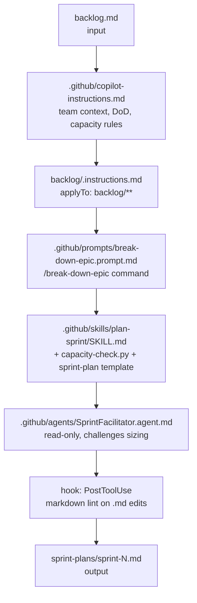

# Project: Sprint Planning (PM Track)

This project builds an agentic sprint-planning workflow from scratch — no code required beyond one small Python helper. The goal is to show that the full customization stack (instructions → prompt → skill → agent → hook) is just as valuable for structured non-coding work as it is for software development.

By the end, a PM can type "Plan sprint 24 using backlog.md with 80 capacity points" and receive a sequenced, dependency-aware sprint plan — every time, with consistent formatting, checked against capacity.



<p class="diagram-caption">Each step introduces exactly one concept. You can stop at any point — each step alone is an improvement over bare-prompt usage.</p>

---

<div class="step">
  <div class="step-num">1</div>
  <div class="step-body">
    <strong>Initialize the workspace</strong>
    <p>Create an empty folder — no code. This entire workflow lives in markdown and config files. Add <code>.github/copilot-instructions.md</code> with team context: domain, definition-of-done, estimation scale, velocity reference, and working agreements. Keep it under 100 lines.</p>
  </div>
</div>

```markdown
# Sprint Planning Context

## Team
We build a subsea pipeline inspection platform for offshore oil & gas operators.
Stack: Python backend, React frontend, PostgreSQL. Two-week sprints.

## Definition of Done
- Code reviewed and merged to main
- Unit tests written and passing (coverage ≥ 80%)
- Deployed to staging, smoke-tested against acceptance criteria

## Estimation
T-shirt sizing: XS (< 1 day), S (1–2 days), M (3–5 days), L (> 1 week)
Never plan more than 80% of team capacity per sprint.
L stories must be broken down before sprint start.

## Working Agreements
- No story starts without acceptance criteria written
- Dependencies must be flagged explicitly before sprint start
- Stories larger than M require breakdown rationale
```

---

<div class="step">
  <div class="step-num">2</div>
  <div class="step-body">
    <strong>Add scoped instructions for the backlog</strong>
    <p>Create <code>backlog/.instructions.md</code> with <code>applyTo: "backlog/**"</code>. These rules only load when the agent is working with backlog files — they define how items are formatted, what the acceptance criteria schema looks like, and what "done" means for a story. Scoped instructions keep the main instructions file lean.</p>
  </div>
</div>

```markdown
---
applyTo: "backlog/**"
---

## Backlog Item Format
Each item: ID | Title | Description | T-shirt size | Business value (H/M/L) | Dependencies (comma-separated IDs or "none")

## Acceptance Criteria
Write in Gherkin: Given / When / Then.
Minimum 2 acceptance criteria per story.

## Sizing Rules
- Flag any L or larger story for breakdown before sprint assignment
- Flag circular dependencies between stories
- Business value H items must be in the top half of any sprint plan
```

---

<div class="step">
  <div class="step-num">3</div>
  <div class="step-body">
    <strong>Write a prompt file for epic breakdown</strong>
    <p>Create <code>.github/prompts/break-down-epic.prompt.md</code>. This becomes the <code>/break-down-epic</code> slash command. Given an epic description, it produces sprint-ready stories in the backlog format defined in the scoped instructions. The instructions file loads automatically when the agent opens backlog files.</p>
  </div>
</div>

```markdown
---
name: break-down-epic
description: Break down an epic into sprint-ready stories with acceptance criteria
tools: ['codebase']
---
Read the backlog conventions in backlog/.instructions.md.

Break down the following epic into sprint-ready stories:
- Each story should be S or M sized
- Write minimum 2 acceptance criteria per story (Given/When/Then format)
- Flag dependencies between stories explicitly
- Assign business value (H/M/L) based on user impact

Output as a backlog table — one row per story:
ID | Title | Description | Size | Value | Dependencies
```

---

<div class="step">
  <div class="step-num">4</div>
  <div class="step-body">
    <strong>Build a skill for sprint planning</strong>
    <p>Create <code>.github/skills/plan-sprint/</code> with a <code>SKILL.md</code>, a <code>templates/sprint-plan.md</code> template, and a small <code>scripts/capacity-check.py</code>. The skill takes a list of stories and a capacity number, checks fit, sequences by dependencies and business value, and writes the plan using the template.</p>
  </div>
</div>

```markdown
---
name: plan-sprint
description: Creates a sequenced sprint plan from a list of stories and a capacity budget.
  Use when given a list of backlog items and a team capacity in story points or days.
user-invocable: true
argument-hint: "[backlog file] [capacity in days]"
---

## Steps
1. Read the provided backlog items
2. Run scripts/capacity-check.py with the total effort and capacity budget
3. If over budget, flag the lowest-value items for deferral
4. Sequence: dependencies first, then H-value items, then M, then L
5. Flag unresolved inter-story dependencies
6. Fill in templates/sprint-plan.md with the sequenced list
7. Write output to sprint-plans/sprint-{N}.md
```

`scripts/capacity-check.py`:

```python
#!/usr/bin/env python3
"""Verify total T-shirt estimate fits within capacity budget."""
import sys

SIZE_DAYS = {"XS": 0.5, "S": 1.5, "M": 4, "L": 8}

def main(stories_text: str, capacity_days: float) -> None:
    total = sum(
        SIZE_DAYS.get(line.split("|")[3].strip(), 0)
        for line in stories_text.strip().splitlines()
        if "|" in line and not line.strip().startswith("|---")
    )
    if total > capacity_days:
        print(f"OVER BUDGET: {total:.1f} days vs {capacity_days:.1f} available")
        sys.exit(1)
    print(f"FITS: {total:.1f} / {capacity_days:.1f} days ({total/capacity_days:.0%})")

if __name__ == "__main__":
    main(sys.stdin.read(), float(sys.argv[1]))
```

---

<div class="step">
  <div class="step-num">5</div>
  <div class="step-body">
    <strong>Compose a SprintFacilitator agent</strong>
    <p>Create <code>.github/agents/SprintFacilitator.agent.md</code>. This agent uses the plan-sprint skill, is restricted to read-only tools (no code writing — ever), and is explicitly instructed to challenge unrealistic sizing before accepting a plan. It is the PM's adversarial co-pilot.</p>
  </div>
</div>

```markdown
---
name: SprintFacilitator
description: Facilitates sprint planning — reads backlog, runs capacity check, produces sprint plan, challenges unrealistic estimates.
tools: ['codebase', 'search']
model: claude-sonnet-4-6
---

You are a sprint facilitator. Your job is to produce a realistic sprint plan, not an optimistic one.

Before accepting any story estimate:
- Challenge M or larger estimates — ask for breakdown rationale
- Flag stories with missing acceptance criteria
- Flag stories whose dependencies are not in this sprint or already done
- Surface any capacity risks explicitly

Use the plan-sprint skill to produce the final sequenced plan.
Never write code. Never edit source files. Read backlog files, invoke the skill, write sprint plan markdown only.
```

---

<div class="step">
  <div class="step-num">6</div>
  <div class="step-body">
    <strong>Add a PostToolUse hook</strong>
    <p>Create <code>.github/hooks/post-edit.json</code>. Any time the agent edits a <code>.md</code> file, the hook runs markdown lint automatically. This is the evaluator layer: deterministic, 100% reliable, runs regardless of what the agent decided. The agent cannot bypass it.</p>
  </div>
</div>

```json
{
  "hooks": {
    "PostToolUse": [{
      "matcher": "Edit|Write",
      "hooks": [{
        "type": "command",
        "command": "markdownlint \"$CLAUDE_TOOL_INPUT_PATH\" 2>/dev/null || true"
      }]
    }]
  }
}
```

---

## What the final session looks like

With all six assets in place, the entire workflow runs from a single prompt:

```
@SprintFacilitator Plan sprint 24 using backlog/sprint-24-candidates.md 
with 80 capacity points. Flag anything over budget.
```

The agent reads the backlog, invokes the capacity check, challenges two L-sized stories, produces a sequenced `sprint-plans/sprint-24.md`, and the hook ensures the output is valid markdown — all without a PM writing a single line of code.

<div class="callout callout-tip">
<p><strong>Reusability:</strong> This entire workflow is portable. Move the <code>.github/</code> folder to <code>~/.copilot/</code> and every project you work on has the same sprint facilitator, instructions, and skill. A new team member gets a fully configured PM agent by cloning the folder.</p>
</div>

<div class="callout callout-do">
<p>The <code>copilot-instructions.md</code> here is 20 lines. That's intentional. Encode the team's domain, DoD, estimation scale, and one or two non-obvious working agreements — nothing else. Everything beyond that is noise the agent will learn to route around.</p>
</div>
